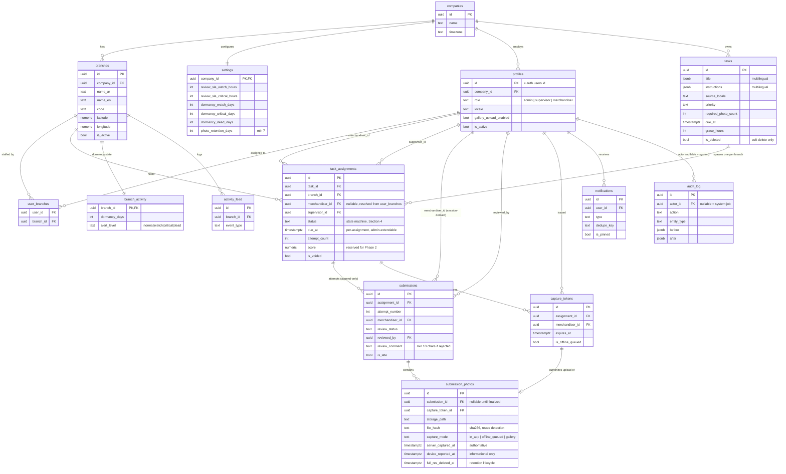

# ALBAROO — Entity Relationship Diagram (Phase 1)

Renders as a diagram in any Mermaid-aware viewer (GitHub, GitLab, most Markdown
previewers). Matches `supabase/migrations/0002_tables.sql`.

```mermaid
erDiagram
  companies ||--o{ branches : has
  companies ||--|| settings : configures
  companies ||--o{ profiles : employs
  companies ||--o{ tasks : owns

  profiles ||--o{ user_branches : "assigned to"
  branches ||--o{ user_branches : "staffed by"

  tasks ||--o{ task_assignments : "spawns one per branch"
  branches ||--o{ task_assignments : hosts
  profiles ||--o{ task_assignments : "merchandiser_id"
  profiles ||--o{ task_assignments : "supervisor_id"

  task_assignments ||--o{ submissions : "attempts (append-only)"
  profiles ||--o{ submissions : "merchandiser_id (session-derived)"
  profiles ||--o{ submissions : "reviewed_by"

  submissions ||--o{ submission_photos : contains
  profiles ||--o{ capture_tokens : issued
  task_assignments ||--o{ capture_tokens : scopes
  capture_tokens ||--o| submission_photos : "authorizes upload of"

  branches ||--|| branch_activity : "dormancy state"
  branches ||--o{ activity_feed : logs

  profiles ||--o{ notifications : receives
  profiles ||--o{ audit_log : "actor (nullable = system)"

  companies {
    uuid id PK
    text name
    text timezone
  }
  branches {
    uuid id PK
    uuid company_id FK
    text name_ar
    text name_en
    text code
    numeric latitude
    numeric longitude
    bool is_active
  }
  profiles {
    uuid id PK "= auth.users.id"
    uuid company_id FK
    text role "admin | supervisor | merchandiser"
    text locale
    bool gallery_upload_enabled
    bool is_active
  }
  user_branches {
    uuid user_id FK
    uuid branch_id FK
  }
  tasks {
    uuid id PK
    jsonb title "multilingual"
    jsonb instructions "multilingual"
    text source_locale
    text priority
    int required_photo_count
    timestamptz due_at
    int grace_hours
    bool is_deleted "soft delete only"
  }
  task_assignments {
    uuid id PK
    uuid task_id FK
    uuid branch_id FK
    uuid merchandiser_id FK "nullable, resolved from user_branches"
    uuid supervisor_id FK
    text status "state machine, Section 4"
    timestamptz due_at "per-assignment, admin-extendable"
    int attempt_count
    numeric score "reserved for Phase 2"
    bool is_voided
  }
  submissions {
    uuid id PK
    uuid assignment_id FK
    int attempt_number
    uuid merchandiser_id FK
    text review_status
    uuid reviewed_by FK
    text review_comment "min 10 chars if rejected"
    bool is_late
  }
  submission_photos {
    uuid id PK
    uuid submission_id FK "nullable until finalized"
    uuid capture_token_id FK
    text storage_path
    text file_hash "sha256, reuse detection"
    text capture_mode "in_app | offline_queued | gallery"
    timestamptz server_captured_at "authoritative"
    timestamptz device_reported_at "informational only"
    timestamptz full_res_deleted_at "retention lifecycle"
  }
  capture_tokens {
    uuid id PK
    uuid assignment_id FK
    uuid merchandiser_id FK
    timestamptz expires_at
    bool is_offline_queued
  }
  branch_activity {
    uuid branch_id PK,FK
    int dormancy_days
    text alert_level "normal|watch|critical|dead"
  }
  activity_feed {
    uuid id PK
    uuid branch_id FK
    text event_type
  }
  notifications {
    uuid id PK
    uuid user_id FK
    text type
    text dedupe_key
    bool is_pinned
  }
  audit_log {
    uuid id PK
    uuid actor_id FK "nullable = system job"
    text action
    text entity_type
    jsonb before
    jsonb after
  }
  settings {
    uuid company_id PK,FK
    int review_sla_watch_hours
    int review_sla_critical_hours
    int dormancy_watch_days
    int dormancy_critical_days
    int dormancy_dead_days
    int photo_retention_days "min 7"
  }
```
